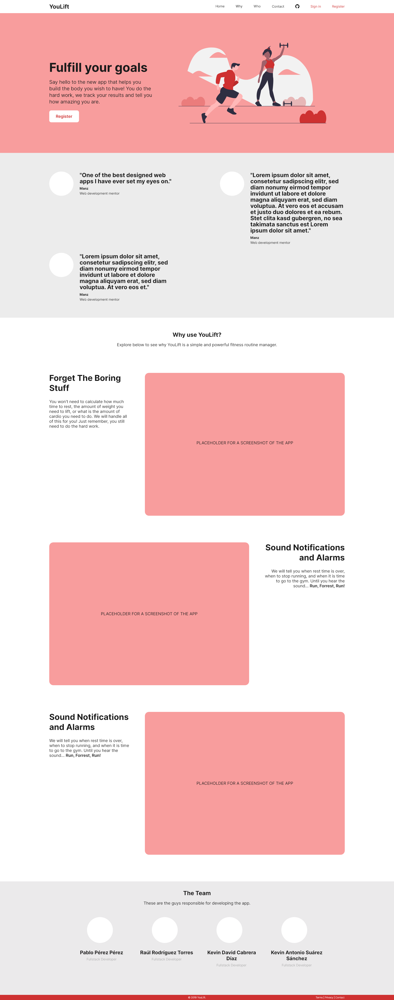

# YouLift Front End

## Description

This is the front-end modules and components for the [youlift.xyz](youlift.xyz) application.
This project depends on [fullstacktf/fitness-backend](https://github.com/fullstacktf/fitness-backend).

## Available Scripts

In the project directory, you can run:

### `npm start`

Runs the app in the development mode.\
Open [http://localhost:3000](http://localhost:3000) to view it in the browser.

The page will reload if you make edits.\
You will also see any lint errors in the console.

### `npm test`

Launches the test runner in the interactive watch mode.\
See the section about [running tests](https://facebook.github.io/create-react-app/docs/running-tests) for more information.

### `npm run storybook`

Runs the Storybook framework in [http://localhost:6006](http://localhost:6006) to view in a browser.
This lets you check and view the components used in the project.

### `npm run build`

Builds the app for production to the `build` folder.\
It correctly bundles React in production mode and optimizes the build for the best performance.

The build is minified and the filenames include the hashes.\
Your app is ready to be deployed!

See the section about [deployment](https://facebook.github.io/create-react-app/docs/deployment) for more information.

## Mockups

### Landing

### Profile

### Contact

### Login

### Register

### Routine Panel

### Routine Item

### Exercise Panel

### Exercise Item

## Credits

[Kevin David Cabrera Díaz](https://github.com/kdcr): Back-end and Databases.

[Raúl Rodríguez Torres](https://github.com/raulrodrigueztorres): Back-end, CORS and Front-end.

[Kevin Antonio Suárez Sánchez](https://github.com/neikox): Front-end.

[Pablo Pérez Pérez](https://github.com/pa-perz): Design and Front-end.
